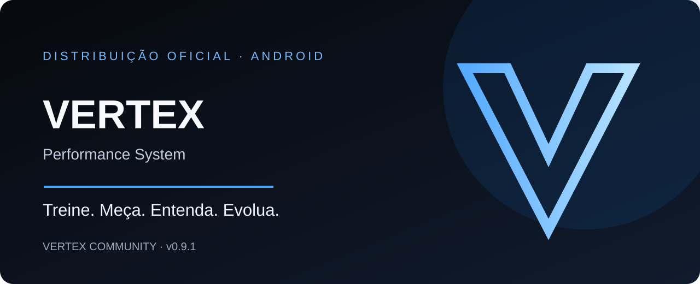

<div align="center">
  
</div>

# VERTEX para Android

Este é o canal oficial de distribuição Android do **VERTEX — Performance System**. Baixe o aplicativo somente nesta página ou na Release oficial abaixo.

## Versão atual: v0.9.1

- **App:** VERTEX Community para atletas
- **Pacote Android:** `com.vertex.jump`
- **Tamanho:** 26.132.033 bytes
- **SHA-256:** `6093c4b1c9fa9bac05233a6419a06749f52031634b68517b25b4c5da2e6b17c9`

### Download

- [Baixar VERTEX-Community-0.9.1.apk](https://github.com/vertex-cloud/vertex-releases/releases/download/v0.9.1/VERTEX-Community-0.9.1.apk)
- [Abrir Release v0.9.1 e conferir detalhes](https://github.com/vertex-cloud/vertex-releases/releases/tag/v0.9.1)
- [Consultar SHA256SUMS.txt](https://github.com/vertex-cloud/vertex-releases/blob/main/SHA256SUMS.txt)

## Instalação

1. Baixe o APK pelo link oficial acima.
2. Confira o SHA-256 antes de instalar.
3. Abra o arquivo baixado. Se o Android solicitar, permita temporariamente a instalação pelo navegador ou aplicativo usado no download.
4. Depois da instalação, desative essa permissão se não precisar mais dela.

O Android pode mostrar um aviso de segurança para apps instalados fora da Play Store. Confira a origem e o checksum antes de continuar.

## Verificar o arquivo

No computador, rode:

```bash
sha256sum VERTEX-Community-0.9.1.apk
```

No Windows PowerShell:

```powershell
Get-FileHash .\VERTEX-Community-0.9.1.apk -Algorithm SHA256
```

Compare o valor completo com o SHA-256 listado acima ou em [SHA256SUMS.txt](SHA256SUMS.txt). Se não corresponder, não instale o APK.

## Sobre o VERTEX

Treine · Meça · Entenda · Evolua.

A versão 0.9.1 inclui Jornada VERTEX, melhorias de perfil, Stories, notificações e melhorias de estabilidade. Medições com câmera podem variar conforme iluminação, enquadramento, posição do aparelho e taxa de quadros; use-as como referência, não como avaliação médica.

## Segurança e escopo

Este repositório publica apenas materiais públicos de distribuição: documentação, checksums e APKs aprovados. Não inclua código-fonte privado, credenciais, chaves de assinatura ou o aplicativo **VERTEX Control/Admin**.

Não compartilhe senhas, códigos de autenticação ou arquivos de chave para obter o aplicativo. Para relatar problemas, use a aba [Issues](https://github.com/vertex-cloud/vertex-releases/issues).
